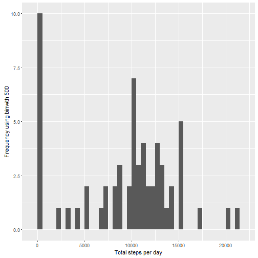
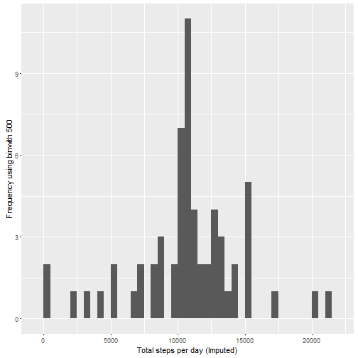
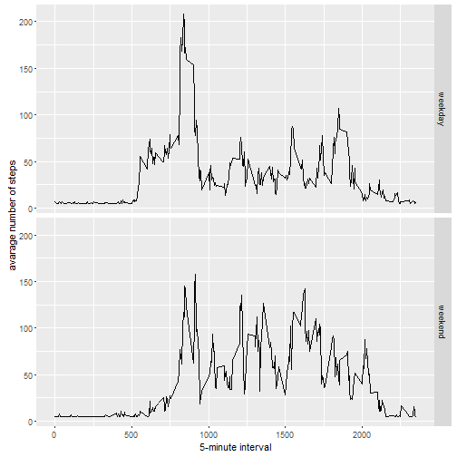

This is an R Markdown document. Markdown is a simple formatting syntax for authoring HTML, PDF, and MS Word documents. For more details on using R Markdown see <http://rmarkdown.rstudio.com>.

When you click the **Knit** button a document will be generated that includes both content as well as the output of any embedded R code chunks within the document. You can embed an R code chunk like this:

#Reproducible Research: Peer Assessment 1  


```r
library(ggplot2)
## If scales and Hmisc packages are not installed on your computer
## first install them through install.packages()
library(scales)
library(Hmisc)
```

#Loading and preprocessing the data
##1. Load the data (i.e. read.csv())

```r
## set the working directory to the working directory as below
## if different set the file path for activity.csv as per your
## system
##setwd("C:/Program Files/RStudio/repdata_data_activity/activity.csv")
if(!file.exists('activity.csv')){
    unzip('activity.zip')
}
storeactivityData <- read.csv('activity.csv')
```

#What is mean total number of steps taken per day?

```r
stepstakenperDay <- tapply(storeactivityData$steps, storeactivityData$date, sum, na.rm=TRUE)
```
##1. This produces a histogram of the total number of steps taken each day

```r
qplot(stepstakenperDay, xlab='Total steps per day', ylab='Frequency using binwith 500', binwidth=500)
```


##2. This Calculates and report the mean and median total number of steps taken per day

```r
stepstakenperDayMean <- mean(stepstakenperDay)
stepstakenperDayMedian <- median(stepstakenperDay)
```
#This section evaluates the average daily activity pattern?

```r
averageNumStepsTaken <- aggregate(x=list(meanStepsTaken=storeactivityData$steps), by=list(interval=storeactivityData$interval), FUN=mean, na.rm=TRUE)
```
##1.This section produces a time series plot of 5 minutes interval

```r
ggplot(data=averageNumStepsTaken, aes(x=interval, y=meanStepsTaken)) +
    geom_line() +
    xlab("5-minute interval") +
    ylab("average number of steps taken") 
```


##2.Identify 5-minute interval which contains the max number of steps, based on an average across all the days in the dataset

```r
MaxNumSteps <- which.max(averageNumStepsTaken$meanStepsTaken)
timeMaxSteps <-  gsub("([0-9]{1,2})([0-9]{2})", "\\1:\\2", averageNumStepsTaken[MaxNumSteps,'interval'])
```
#Calculate and report the total number of missing values in the dataset

```r
numberMissingValues <- length(which(is.na(storeactivityData$steps)))
##Create a new dataset that is equal to the original dataset but with 
##the missing data filled in.
activityDataImputing <- storeactivityData
activityDataImputing$steps <- impute(storeactivityData$steps, fun=mean)
##Make a histogram of the total number of steps taken each day
stepsTakenDayImputed <- tapply(activityDataImputing$steps, activityDataImputing$date, sum)
qplot(stepsTakenDayImputed, xlab='Total steps per day (Imputed)', ylab='Frequency using binwith 500', binwidth=500)
```



```r
##Calculate and report the mean and median total number of steps taken per day.
stepsTakenPerDayMeanImputed <- mean(stepsTakenDayImputed)
stepsTakenPerDayMedianImputed <- median(stepsTakenDayImputed)
```
#Create a new factor variable in the dataset with two levels - "weekday" and "weekend" #indicating whether a given date is a weekday or weekend day.

```r
activityDataImputing$dateType <-  ifelse(as.POSIXlt(activityDataImputing$date)$wday %in% c(0,6), 'weekend', 'weekday')
##Make a panel plot containing a time series plot of 5 minute interval
avrActDataImputed <- aggregate(steps ~ interval + dateType, data=activityDataImputing, mean)
ggplot(avrActDataImputed, aes(interval, steps)) + 
    geom_line() + 
    facet_grid(dateType ~ .) +
    xlab("5-minute interval") + 
    ylab("avarage number of steps")
```


